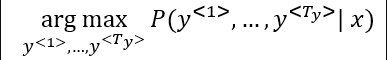

# Seq2Seq - Neural Machine translation

Neural Machine Translation (NMT) **i**s a way to do Machine Translation with a single neural network. The neural network architecture is called **sequence-to-sequence (aka seq2seq)** and it involves **two RNNs**

The sequence-to-sequence model is an example of a **conditional Language Model.**

- **It is a Language Model** because the decoder is predicting the next word of the target sentence y.
- It is **Conditional** because its predictions are also conditioned on the source sentence x. NMT directly calculate $P(y|x)$.
- In language model: $P(y_1, ..., y_{T})$
- In machine translation: $P(y_1, ..., y_{T}|x_1, ...,x_T)$
- What we don't want in machine translation model, is not to sample the output at random. This may provide some choices as an output. Sometimes you may sample a bad output.
- Ideally, we want to find a translation $y$ that maximizes $p(y | x)$.
- So we need to get the best output it can be:

*We could try computing all possible sequences y.* This means that on each step t of the decoder, we are tracking $V_t$ possible partial translations, where V is vocab size. This $O(V^T)$ complexity is **far too expensive!**

# Beam Search

- Beam search is the most widely used algorithm to get the best output sequence. It's a heuristic search algorithm.
- To illustrate the algorithm we will stick with the example from the previous section. We need Y = "Jane is visiting Africa in September."
- The algorithm has a parameter `B` which is the beam width. Lets take `B = 3` which means the algorithm will get 3 outputs at a time.
- For the first step you will get ["in", "jane", "september"] words that are the best candidates.
- Then for each word in the first output, get B next (second) words and select top best B combinations where the best are those what give the highest value of multiplying both probabilities - $P(y^{<1>}|x)*P(y^{<2>}|x, y^{<1>})$ . So we will have then ["in september", "jane is", "jane visit"]. Notice, that we automatically discard *september* as a first word.
- Repeat the same process and get the best B words for ["september", "is", "visit"] and so on.
- In this algorithm, keep only B instances of your network.
- If `B = 1` this will become the greedy search.

## Stopping Criteria for Beam Search

- In greedy decoding, we usually decode until model produces a <END> token,
  - for example, `<START> he hit me with a pie <END>`.
- In beam search decoding, different hypotheses may produce <END> tokens on different timesteps.
  - When a hypothesis produces <END>, that hypothesis is complete.
  - Beam searching places it aside and continues exploring other hypotheses. **\*\***
- We usually continue beam search until we reach timestep T ( where T is some pre-defined cutoff), or we have at least n completed hypotheses (where n is pre-defined cutoff).

## Refinement to Beam Search

- The first thing is **Length optimization**

- The second thing is how can we choose best `B`?
  - The larger B - the larger possibilities, the better are the results. But it will be more computationally expensive.
  - In practice, you might see in the production setting `B=10`
  - `B=100`, `B=1000` are uncommon (sometimes used in research settings)
  - Unlike exact search algorithms like BFS (Breadth First Search) or DFS (Depth First Search), Beam Search runs faster but is not guaranteed to find the exact solution.

# Attention Model

The bottleneck problem of seq2seq is that the bottleneck needs to capture all information about the source sentence. It made it challenging for the models to deal with long sentences. Attention provides a solution to the bottleneck problem. **_The core idea is that, on each step of the decoder, use a direct connection to the encoder to focus on a particular part of the source sequence_**.

- Instead of passing the last hidden state of the encoding stage, the encoder passes _all_ the hidden states to the decoder.
- Second, an attention decoder does an extra step before producing its output:
  1. Look at the set of encoder hidden states it received – each encoder hidden state is most associated with a certain word in the input sentence
  2. Give each hidden state a score (let’s ignore how the scoring is done for now)
  3. Multiply each hidden state by its softmaxed score, thus amplifying hidden states with high scores, and drowning out hidden states with low scores.

Attention solves the bottleneck problem by allowing the decoder to look directly source and bypass bottleneck. Attention helps with vanishing gradient problem by provides a shortcut to faraway states.

Note that the model isn’t just mindless aligning the first word at the output with the first word from the input. It actually learned from the training phase how to align words in that language pair.

One fun way to see how attention works is by visualizing the attention weights:

# BLEU Score

- One of the challenges of machine translation, is that given a sentence in a language there are one or more possible good translation in another language. So how do we evaluate our results?
- The way we do this is by using **BLEU score**. BLEU stands for *bilingual evaluation understudy*.
- The intuition is: as long as the machine-generated translation is pretty close to any of the references provided by humans, then it will get a high BLEU score.

BLEU score on bigrams

- The **n-grams** typically are collected from a text or speech corpus. When the items are words, **n-grams** may also be called shingles. An **n-gram** of size 1 is referred to as a "unigram"; size 2 is a "bigram" (or, less commonly, a "digram"); size 3 is a "trigram".

# References

- [NLP with Deep Learning - Translation, Seq2Seq, Attention](https://youtu.be/XXtpJxZBa2c?si=38VXFikr2eiAcjbf)
- [Visualizing A Neural Machine Translation Model (Mechanics of Seq2seq Models With Attention)](https://jalammar.github.io/visualizing-neural-machine-translation-mechanics-of-seq2seq-models-with-attention/)
- [Andrew Ng Sequence models](https://www.youtube.com/watch?v=S7oA5C43Rbc)
