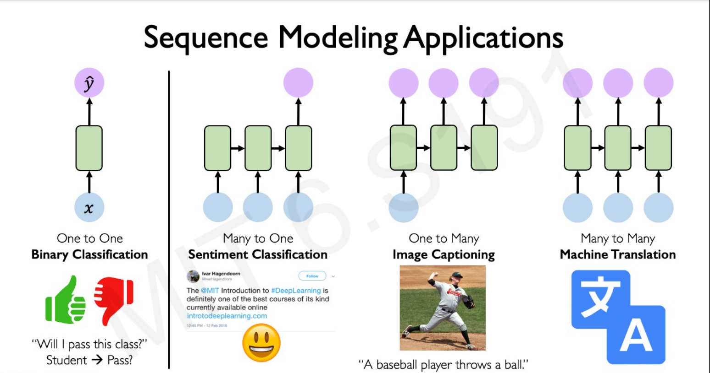

# RNN

# **Introduction to Sequence Models**

Traditional neural networks do not account for the temporal nature of data. They treat inputs as independent entities, which is not suitable for tasks like language understanding, where word order is crucial. Sequence models are designed to capture and understand patterns in data that occur over time.

- **Use Cases**:
    - Speech recognition: Understanding spoken language where each sound is dependent on the previous ones.
    - Sentiment analysis: Analyzing the sentiment of a sentence or paragraph where the meaning can change with context.

## Why Sequence Models?

# **Recurrent Neural Network (RNN)**

## **Definition**

A Recurrent Neural Network (RNN) is a class of neural networks that have shown great success in handling sequential data. RNNs are capable of capturing the temporal dependencies and patterns in sequential data by maintaining an internal memory or hidden state that persists as new inputs are processed. This enables them to process sequences of varying lengths and understand the context of each element based on the sequence.

## **Architecture Overview**

- RNNs have connections that form loops, allowing information to persist through time steps. This looped structure enables the network to carry context from one step to the next.
- The same set of weights and biases are shared across all time steps.

## Forward Pass

During the forward pass, we compute the hidden states and output for each time step using the given equations:

Hidden state at time step t:

$h_t = tanh(W_{hh}h_{t−1} + W_{xh}x_t)$

Output at time step t:

$y_t = W_{hy}h_t$

Where:

- $h_t$ is the hidden state at time step `t`.
- $x_t$  is the input at time step `t`.
- $W_{hh}$ is the weight matrix for the hidden-to-hidden connections.
- $W_{xh}$ is the weight matrix for the input-to-hidden connections.
- $W_{ho}$ is the weight matrix for the hidden-to-output connections.
- $tanh$  is the activation function

## **Backpropagation through time**

Backpropagation to handle sequential information.

- In RNN backpropagate through individual time steps
- Then do that across all time time steps all the way from current back to the beginning of the sequence.

### Defining total Loss

- Where the first equation is the loss for one example and the loss for the whole sequence is given by the summation over all the calculated single example losses.

## **RNN Pros & Cons**

**Advantages**:

- **Effective for Sequential Data**: RNNs are designed to handle sequences, making them suitable for tasks like time series prediction and natural language processing.
- **Contextual Understanding**: They can capture dependencies between elements, enabling them to make contextually informed predictions.
- **Flexibility with Input Lengths**: Unlike traditional neural networks, RNNs can handle inputs of varying lengths.

**Challenges**:

- **Gradient Problems**: Standard RNNs often struggle with learning long-term dependencies due to vanishing or exploding gradient issues. *Vanishing gradients* problem tends to be the bigger problem with RNNs than the *exploding gradients* problem.
- **Computationally Intensive**: RNNs can be slow to train, especially on long sequences, and may require substantial computational resources.
- **Assumption of Fixed Time Intervals**: They assume fixed time intervals between steps, which might not always align with real-world scenarios.

## Gradient issues in RNN

- Exploding gradient
    - **************************Solution:************************** Gradient clipping to scale big gradient
    
    
    
- Vanishing gradients
    
    
    

## LSTM and GRU

GRU and LSTM are types of RNN that can help solve the vanishing gradient problem and can remember the long-term dependencies.

## LSTM(

The cell state is independent from what is directly outputted.

Cell state update with gates that control flow of information.

## GRU

GRU is another variant of the traditional RNN architecture, like LSTM, designed to handle long-term dependencies.

### Components of a GRU:

1. **Update Gate** 
    - Determines how much of the previous state to keep, similar to the forget gate in LSTM.
2. **Reset Gate** 
    - Determines how much of the previous state to forget.
3. **Candidate Hidden State** 
    - Contains the new candidate values that could be added to the state.
4. **Hidden State** 
    - Computed by combining the previous hidden state with the candidate state.

# **Language Models**

- **Definition**: Language models are a type of sequence model that assigns probabilities to sequences of words. They learn the likelihood of a word occurring given the previous words in a sentence.
- The job of a language model is to give a probability of any given sequence of words.
- **Applications**:
    - Machine translation: Translating sentences from one language to another.
    - Speech recognition: Converting spoken language into text.
    - Auto-generating text: Creating coherent sentences or paragraphs.
- **How to build language models with RNNs?**
    - The first thing is to get a **training set**: a large corpus of target language text.
    - Then tokenize this training set by getting the vocabulary and then one-hot each word.
    - Put an end of sentence token `<EOS>` with the vocabulary and include it with each converted sentence. Also, use the token `<UNK>` for the unknown words.
- Given the sentence "Cats average 15 hours of sleep a day. `<EOS>`"
    - In training time we will use this:
        
        
        
    - The loss function is defined by cross-entropy loss:
        
        
        
        - `i` is for all elements in the corpus, `t` - for all timesteps.
    - To use this model:
        1. For predicting the chance of **next word**, we feed the sentence to the RNN and then get the final $\hat{y}^{<t>}$ vector and sort it by maximum probability.
        2. For taking the **probability of a sentence**, we compute this:
            - $p(y^{<1>}, y^{<2>}, y^{<3>} = p(y^{<1>})p(y^{<2>}| y^{<1>})*p(y^{<3>}| y^{<1>}, y^{<2>})$
            - This is simply feeding the sentence into the RNN and multiplying the probabilities (outputs).

# References

- [Andrew Ng Sequence models](https://www.youtube.com/watch?v=S7oA5C43Rbc)
- [Deep Sequence Models](https://www.youtube.com/watch?v=ySEx_Bqxvvo&ab_channel=AlexanderAmini)
- [Illustrated Guide to LSTM and GRU](https://youtu.be/8HyCNIVRbSU?si=lWjldBoZf5c3eF7z)
